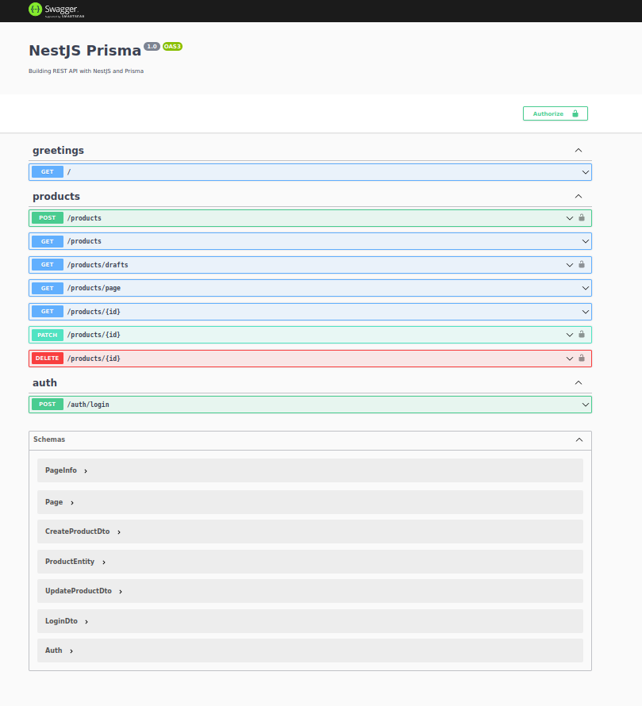
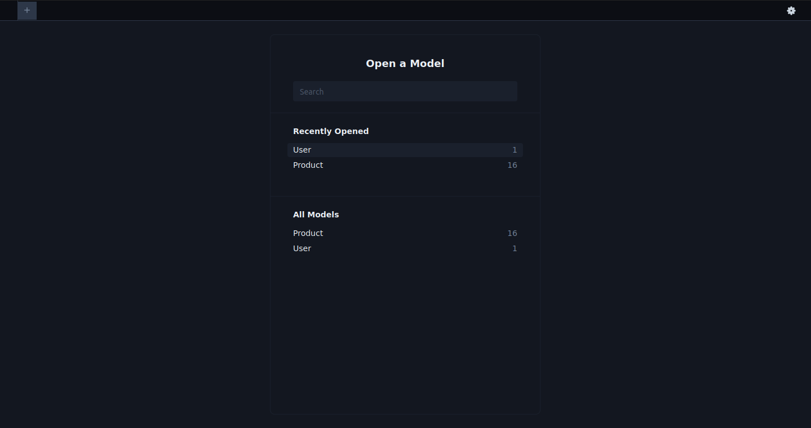

# Building a REST API with NestJS and Prisma

<p align="center">
  
</p>

This repository contains the starter project for the **Building a REST API with NestJS and Prisma** workshop by [Marc Stammerjohann](https://twitter.com/mrcjln).

# Getting Started

1. Clone this repository

You can clone this repository with the following command:

```bash
# SSH
git clone git@github.com:alexandresantosm/nestjs-prisma.git

# HTTPS
git clone https://github.com/alexandresantosm/nestjs-prisma.git

# GitHub CLI
gh repo clone alexandresantosm/nestjs-prisma
```

2. Install dependencies

```bash
cd nestjs-prisma
yarn install
```

3. Install NestJS CLI if you haven't already

```bash
npm i -g @nestjs/cli
```

# More

<p align="center">
  
</p>

Screenshot Prisma Studio application with all models created in the database.

## Workshop

Use this repo as the starting point and follow the lessons for the [workshop](https://pris.ly/day2021-nestjs).
The recorded version is available on Youtube [Building a REST API with NestJS and Prisma](https://www.youtube.com/watch?v=mmbd5hcQUaY).

---

Build with 💜 by Alexandre 👋🏻.
